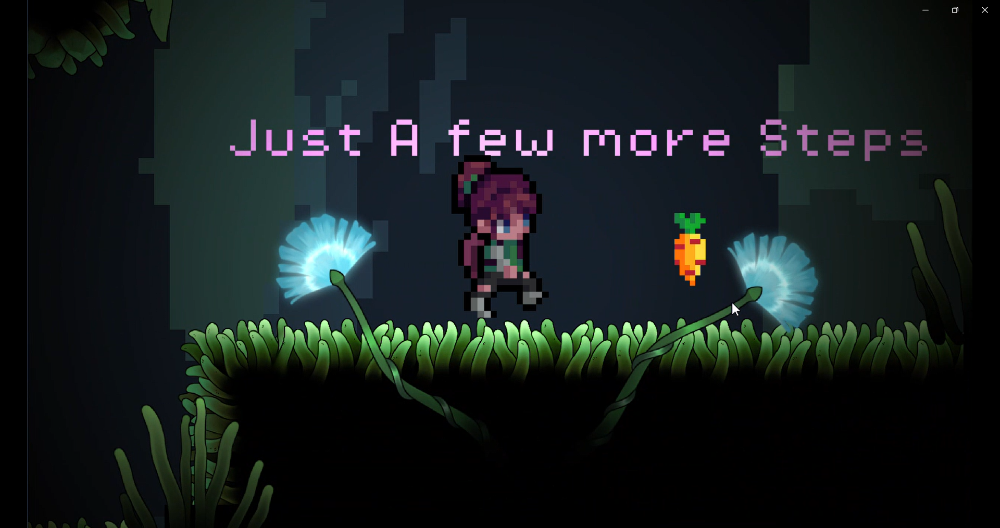
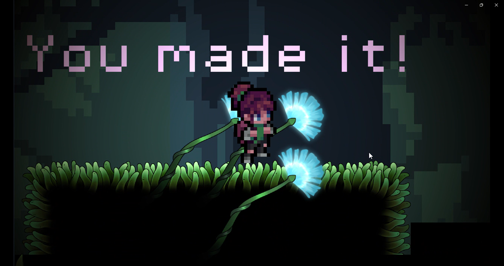
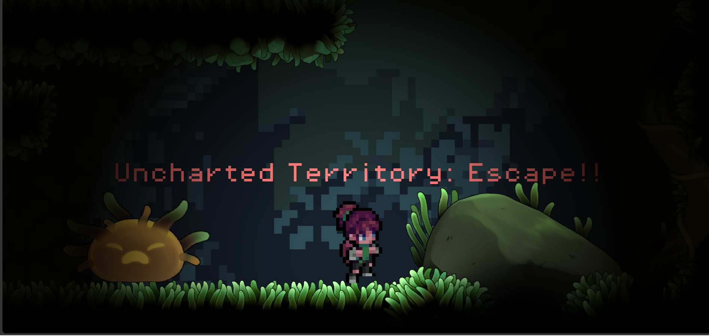
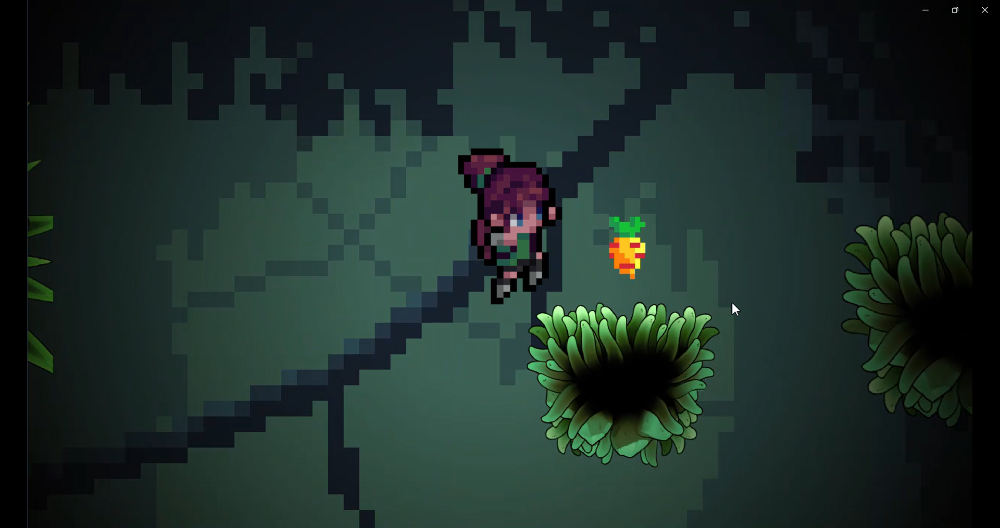

# The Long Walk Home

# Description
The Long Walk Home is a 2D platformer about perseverance and healing, inspired by Celeste.It's Journey through a series of increasingly challenging levels filled obstacles and enemies that embody the protagonist's own fears and self-doubt. Every obstacle overcome is another step toward home, not a place, but Contentment.With little Encouraging Easter Eggs throughout the game, player is nudged to keep moving.

# Highlights
-Multi-level 2D platformer
-enemy AI using RayCasting
-Collectible items with score tracking
-Dynamic Platforms
-Custom made Worlds (this took alot of time)
-Main menu
-Respawn system with intentional respawn delay for improved game feel
-Level progression system
-One way Platforms for smoother player movement
-Thematic storytelling through gameplay

# Why I made it?
Honestly, i resonate with the protagonist alot. I struggle with motivation and even small task sometimes feel alot. I wanted this project to kind of reflect this and i to give GamDev a proper go.The actual game mechanics and handling physics properties were also kind of fun.

# Photos

# Improvements
I plan to add cutscenes in future for better gamplay, minigames to progress through each level which was my original plan. And improve UI
The Exit button has no dramatic Ending scene change which is kind of boring.

# AI Usage
there was no AI usage since even for debugging i consulted people to explain the problem. though i did major debugging myself.

